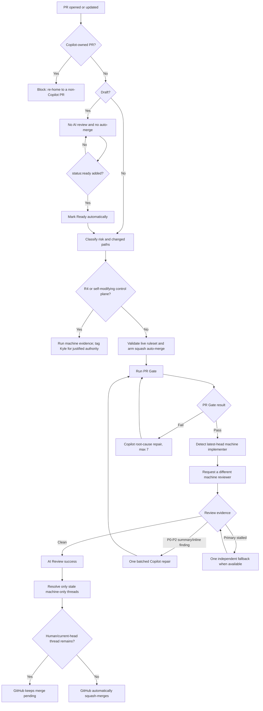

# Delivery and GitHub

## Goal

Use GitHub as the protected integration plane while keeping feedback fast, model spend bounded, and routine merges fully unattended.

## 1. Durable work model

GitHub Issues are the durable work-item source. A PR is the smallest coherent integration unit.

`Issue → SPEC only if needed → thin slices → PR (opened Ready, risk label at creation) → PR Gate → GitHub auto-merge → release → observe`

Open PRs non-draft with the `risk:R*` label already applied so the lane engages with zero promotion latency. Draft-first remains supported (label `status:ready` to promote), just slower.

Do not enlarge PRs merely to save CI minutes. Save minutes through local slice verification, fewer pushes, cancellation, caching, and path/risk-aware tests.

## 2. Shared versus repository-specific configuration

Centralized in `agent-engineering-standard`:

- portfolio policy and repository list
- ruleset/settings application
- exact-head review evaluator and bounded review repair
- PR state machine and repair budgets
- bootstrap and idempotent upgrade scripts
- remote doctor
- workflow caller templates
- branch/worktree cleanup

Kept in each product repository:

- stack-specific `PR Gate` commands
- product PRD, specs, ADRs, tests, and release/deploy logic
- a pinned `.agent/standard.lock`
- thin `ai-review.yml` and `pr-automation.yml` callers pinned to that exact SHA

Product callers never follow moving `@main`. Updating shared behavior is an explicit standard-upgrade PR.

## 3. Required checks and settings

Every managed repository requires this latest-head GitHub Actions context:

- `PR Gate`: deterministic repo-specific evidence

`AI Review` is advisory-only and off by default (ADR 0002): `independent_review.required_for_auto_merge` restores it as a required context; `solicit_reviews` runs it informationally without gating.

Repository defaults:

- pull request required
- human approvals: `0`
- Code Owner approval: off
- native `.github/CODEOWNERS`: absent
- `kgsmith19`: forbidden from requested-reviewer state
- review-thread resolution not required (no required reviewer exists to resolve a stray thread; ADR 0002)
- stale reviews dismissed after a push
- auto-merge and update branch enabled
- squash only; merge commits and rebase disabled
- force-push and default-branch deletion blocked
- merged branches deleted
- no ruleset bypass actors
- workflow token read-only by default and unable to approve reviews
- Copilot cloud-agent workflow approval disabled

The canonical ruleset is the sole default-branch authority. Legacy branch protection is removed so it cannot silently reintroduce old checks or approvals.

## 4. Complete PR decision flow



A push always creates a new decision cycle. Old `AI Review` evidence cannot authorize a new head.

## 5. Draft PR rules

Drafts are the low-cost implementation workspace:

- repository `PR Gate` may defer draft checks
- no semantic reviewer is requested
- the AI Review workflow does not run on ordinary pushes
- auto-merge is disabled
- pushes do not consume review budget

When coherent, the agent adds `status:ready`. `PR Automation` marks the draft Ready, removes the label, arms auto-merge when eligible, and begins the normal gate sequence.

GitHub cannot merge a draft. Automatic promotion is the correct solution; eliminating drafts would increase review and CI spend.

## 6. Machine review rules

The review is never a request to Kyle.

Reviewer independence is determined from the latest head commit's authenticated machine actor:

- Copilot-implemented head → Codex review
- Codex-implemented head → Copilot review
- human/unknown head → Codex primary with one Copilot fallback
- Claude is not counted until a mechanical GitHub review adapter exists
- branch names and editable PR text never prove identity

One response covers correctness/security, requirement fit, business ROI, systems optimization, and strict leanness.

Accepted clean evidence:

- clean formal Codex/Copilot review on the exact head
- structured Copilot `AI-REVIEW PASS` containing the exact SHA
- Codex thumbs-up created after the exact-head request

Material P0-P2 evidence in either the formal summary or inline review comments fails `AI Review`. The AI Review workflow requests one batched Copilot repair on the existing PR. The repaired head is then reviewed by a different provider. If that second reviewed head still has material findings, automation blocks rather than purchasing an open-ended loop.

The AI Review runner wakes only when semantic evidence changes: formal review, inline review comment, or PR conversation comment. Ordinary pushes do not start it; `PR Automation` performs the initial exact-head evaluation after `PR Gate` succeeds.

## 7. Recovery matrix

| Condition | Automated action | Budget | Final stop condition |
|---|---|---:|---|
| PR Gate fails | Copilot reads complete logs and fixes root cause | 7 | `status:blocked` |
| Formal or inline review finds P0-P2 | Copilot performs one batched repair | 1 | second reviewed head still fails |
| Codex review stalls | independent Copilot review fallback when allowed | 1 per head | 12-hour reviewer safety timeout |
| Merge conflict | Dependabot rebase or Copilot semantic conflict resolution | 6 | `status:blocked` |
| Draft ready for integration | `status:ready` promotes to Ready | 1 state change | remains draft without label |
| New push after green review | invalidate old review and restart | max 2 reviewed heads | `status:blocked` |
| R4 | automated evidence, then human authority | none | explicit authorization |
| Self-modifying control plane | automated evidence, then owner integration | none | external immutable judge exists |

A stop never silently assigns Kyle as reviewer. It posts the exact blocker and tags him only when a real decision is required.

## 8. Actions and model efficiency

- deterministic checks before model review
- no draft or every-push AI review
- one batched multi-lens response
- initial reviewed head plus one post-fix reviewed head
- cancel superseded deterministic/evaluator runs
- exact-head markers suppress duplicate requests
- 3-minute primary polling plus 3-minute fallback polling
- hourly safety watchdog (12-hour reviewer timeout when review is enabled), not continuous polling
- path filters and safe caches where useful
- expensive matrices, mutation, load, and broad E2E only when risk/path/release requires them
- measure latency, Actions minutes, model responses, findings caught, and false-positive rate before expanding review

Optimize for trustworthy outcomes per human minute, compute minute, and model cost.

## 9. Existing and new repositories

Existing portfolio rollout:

```powershell
pwsh -NoProfile -File .\scripts\upgrade-repos.ps1 -StandardSha <merged-standard-sha>
pwsh -NoProfile -File .\scripts\setup-portfolio.ps1
pwsh -NoProfile -File .\scripts\doctor.ps1 -Remote
```

`upgrade-repos.ps1` is idempotent for an existing open rollout PR, pins both shared callers to the full standard SHA, removes native CODEOWNERS, labels the rollout R3, and preserves each repository's real deterministic commands.

New repository:

```powershell
pwsh -NoProfile -File .\scripts\bootstrap-repo.ps1 -Name <repo-name>
```

Bootstrap creates the standard files, exact-SHA workflow callers, bootstrap `PR Gate`, labels/ruleset/settings, and one Issue to replace the bootstrap gate with real stack-specific evidence.

GitHub exposes the Copilot workflow-approval configuration through a public read endpoint but no documented write endpoint. New repositories therefore have one justified UI setting: disable `Require approval for workflows`. The doctor refuses readiness while it remains on.

## 10. Shared control-plane inventory

- `policy/github-defaults.json`: policy, budgets, repository list
- `scripts/apply-github-standard.ps1`: live settings, Actions defaults, labels, canonical ruleset
- `scripts/pr-orchestrator.ps1`: PR state machine and bounded recovery
- `scripts/request-machine-review.ps1`: independent reviewer selection/request
- `scripts/evaluate-ai-review.ps1`: formal, inline, structured, and reaction evidence → `AI Review`
- `scripts/request-review-repair.ps1`: one bounded repair for material findings
- `scripts/reconcile-machine-review-threads.ps1`: safe stale machine-only thread cleanup
- `scripts/auto-merge.ps1`: live-policy validation and auto-merge arming
- `scripts/bootstrap-repo.ps1`: new-repo startup
- `scripts/upgrade-repos.ps1`: explicit pinned rollout to existing repos
- `scripts/doctor.ps1 -Remote`: portfolio acceptance test
- `scripts/prune-portfolio.ps1`: conservative worktree/branch cleanup

Reusable workflows execute these tested scripts. Thin product callers pin them to the standard-lock SHA.

## 11. Merge queue and release

Merge queue is deliberately off for the current user-owned portfolio. Enable it only after organization ownership/support and exact-head `merge_group` AI Review are implemented and proven.

Low-risk release: `merge → deploy → smoke`.

Higher-risk release: build once, promote the same immutable artifact, verify after deployment, and preserve rollback/recovery.
