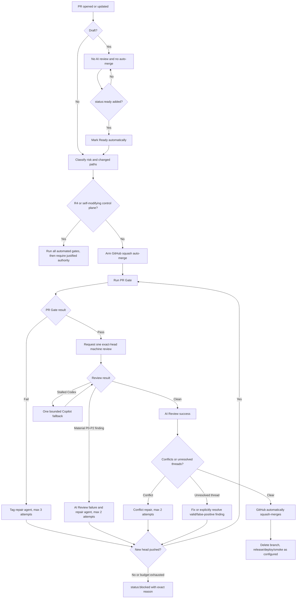

# Delivery and GitHub

## Goal

Use GitHub as the protected integration plane while keeping feedback fast, model spend bounded, and routine merges fully unattended.

## 1. Durable work model

GitHub Issues are the durable work-item source. A PR is the smallest coherent integration unit.

`Issue → SPEC only if needed → thin slices → draft PR → Ready → PR Gate → machine AI Review → GitHub auto-merge → release → observe`

Do not enlarge PRs merely to save CI minutes. Save minutes through local slice verification, fewer pushes, cancellation, caching, and path/risk-aware tests.

## 2. Shared versus repository-specific configuration

Centralized in `agent-engineering-standard`:

- portfolio policy and repository list
- ruleset/settings application
- exact-head AI review evaluator
- PR state machine and repair budgets
- bootstrap and upgrade scripts
- remote doctor
- workflow caller templates
- branch/worktree cleanup

Kept in each product repository:

- stack-specific `PR Gate` commands
- product PRD, specs, ADRs, tests, and release/deploy logic
- a pinned `.agent/standard.lock`
- thin `ai-review.yml` and `pr-automation.yml` callers pinned to that exact standard SHA

Product callers never follow moving `@main`. Updating shared behavior is an explicit standard-upgrade PR.

## 3. Required checks and settings

Every managed repository requires these latest-head GitHub Actions contexts:

- `PR Gate`: deterministic repo-specific evidence
- `AI Review`: one fresh machine review task/session for the exact head

Repository defaults:

- pull request required
- human approvals: `0`
- Code Owner approval: off
- native `.github/CODEOWNERS`: absent, preventing automatic reviewer assignment to Kyle
- review-thread resolution required
- auto-merge enabled
- update branch enabled
- squash only
- merge commits and rebase disabled
- force-push and default-branch deletion blocked
- merged branches deleted
- no ruleset bypass actors
- Copilot cloud-agent workflow approval disabled, so agent PR checks do not wait for a maintainer

## 4. Complete PR decision flow



A push always creates a new decision cycle. Old `AI Review` evidence cannot authorize a new head.

## 5. Draft PR rules

Drafts are the low-cost implementation workspace:

- `PR Gate` may be skipped where the repo workflow explicitly defers draft checks
- no semantic reviewer is requested
- auto-merge is disabled
- pushes do not consume review budget

When coherent, the agent adds `status:ready`. `PR Automation` marks the draft Ready, arms auto-merge when eligible, and begins the normal gate sequence.

GitHub does not support completing auto-merge while a PR remains draft. The correct solution is automatic promotion, not removing drafts.

## 6. Machine review rules

The review is never a request to Kyle.

- PR authored by the Codex GitHub App: Copilot review required
- every other PR: fresh Codex review preferred
- Copilot: one fallback when Codex stalls
- Claude: not counted until a mechanical GitHub review adapter exists
- editable PR text and branch names do not prove implementation identity

One response covers correctness/security, requirement fit, business ROI, systems optimization, and strict leanness.

Accepted clean evidence:

- clean formal Codex/Copilot review on the exact head
- structured Copilot `AI-REVIEW PASS` containing the exact SHA
- Codex thumbs-up created after the exact-head review request

Any current-head P0, P1, or P2 finding fails `AI Review`. The system fixes valid findings and re-runs both gates on the new SHA. It never reviewer-shops around a failure.

## 7. Recovery matrix

| Condition | Automated action | Budget | Final stop condition |
|---|---|---:|---|
| PR Gate fails | Codex investigates logs and fixes root cause | 3 | `status:blocked` |
| Machine review finds P0-P2 | Codex addresses valid findings | 2 | `status:blocked` |
| Codex review stalls | Copilot review fallback | 1 | `status:blocked` |
| Merge conflict | Dependabot rebase or Codex semantic conflict resolution | 2 | `status:blocked` |
| Draft ready for integration | `status:ready` promotes to Ready | 1 state change | remains draft without label |
| New push after green review | invalidate old review and restart | max 2 reviewed heads | `status:blocked` |
| R4 | automated evidence, then human authority | none | explicit authorization |
| Self-modifying control plane | automated evidence, then repository-owner integration | none | external immutable judge exists |

A stop never silently assigns Kyle as reviewer. It posts the exact blocker and required action.

## 8. Actions and model efficiency

- deterministic checks before model review
- no draft or every-push AI review
- one batched review response
- initial reviewed head plus one post-fix reviewed head
- cancel superseded deterministic and evaluator runs
- exact-head markers suppress duplicates
- path filters and safe caches where useful
- expensive matrices, mutation, load, and broad E2E only when risk/path/release requires them
- measure latency, Actions minutes, model responses, findings caught, and false-positive rate before expanding review

Optimize for trustworthy outcomes per human minute, compute minute, and model cost.

## 9. Existing and new repositories

Existing portfolio rollout:

```powershell
pwsh -NoProfile -File .\scripts\upgrade-repos.ps1 -StandardSha <merged-standard-sha>
pwsh -NoProfile -File .\scripts\setup-portfolio.ps1
pwsh -NoProfile -File .\scripts\doctor.ps1 -Remote
```

New repository:

```powershell
pwsh -NoProfile -File .\scripts\bootstrap-repo.ps1 -Name <repo-name>
```

Bootstrap creates the standard files, pinned workflow callers, bootstrap `PR Gate`, labels/ruleset/settings, and a single Issue to replace the bootstrap gate with real stack-specific evidence. The remote doctor remains the completion gate.

GitHub currently exposes the Copilot workflow-approval configuration through a public read endpoint but not a documented write endpoint. New repos therefore have one justified UI setting: disable `Require approval for workflows`. The doctor detects and refuses readiness while it remains on.

## 10. Shared control-plane inventory

- `policy/github-defaults.json`: portfolio policy, budgets, repo list
- `scripts/apply-github-standard.ps1`: live repository settings, labels, rulesets
- `scripts/pr-orchestrator.ps1`: PR state machine and bounded recovery
- `scripts/request-machine-review.ps1`: machine review request/fallback
- `scripts/evaluate-ai-review.ps1`: exact-head review evidence to `AI Review`
- `scripts/auto-merge.ps1`: validates live policy and arms GitHub auto-merge
- `scripts/bootstrap-repo.ps1`: new-repo startup
- `scripts/upgrade-repos.ps1`: explicit pinned rollout to existing repos
- `scripts/doctor.ps1 -Remote`: portfolio acceptance test
- `scripts/prune-portfolio.ps1`: conservative worktree/branch cleanup

The reusable workflows execute these tested scripts. Thin product callers pin them to the standard lock SHA.

## 11. Merge queue and release

Use a merge queue only when repository ownership/plan support and concurrent volume justify it. Exact-head AI review for merge groups must be proven before enabling it.

Low-risk release: `merge → deploy → smoke`.

Higher-risk release: build once, promote the same immutable artifact, verify after deployment, and preserve rollback/recovery.
