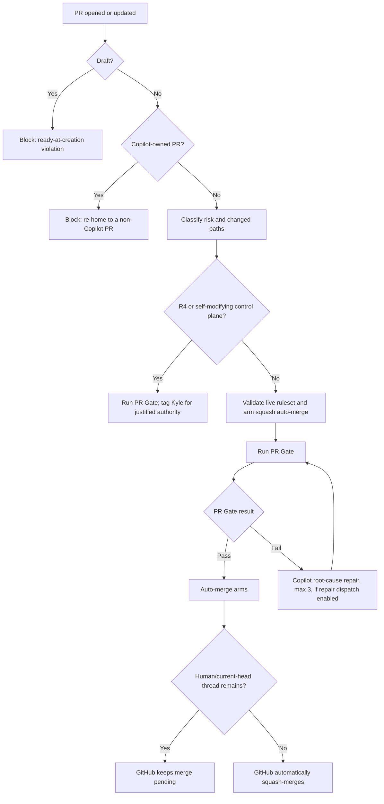

# Delivery and GitHub

## Goal

Use GitHub as the protected integration plane while keeping feedback fast, model spend bounded, and routine merges fully unattended.

## 1. Durable work model

GitHub Issues are the durable work-item source. A PR is the smallest coherent integration unit.

`Issue → SPEC only if needed (local, gitignored, never committed) → thin slices → PR (opened Ready, risk label at creation) → PR Gate → GitHub auto-merge → release → observe`

Open every PR Ready with its `risk:R*` label already applied. REST, SDK, GraphQL, and connector calls set `draft: false`; `gh pr create` omits `--draft`. Verify the returned state before any auto-merge call.

Do not enlarge PRs merely to save CI minutes. Save minutes through local slice verification, fewer pushes, cancellation, caching, and path/risk-aware tests.

## 2. Shared versus repository-specific configuration

Centralized in `agent-engineering-standard`:

- portfolio policy and repository list
- ruleset/settings application
- PR state machine and repair budgets
- bootstrap and idempotent upgrade scripts
- remote doctor
- workflow caller templates
- branch/worktree cleanup

Kept in each product repository:

- stack-specific `PR Gate` commands
- product PRD, tests, and release/deploy logic (SPECs and ADRs may exist locally/gitignored or as durable `docs/adr/` decisions, but SPECs are never committed)
- a pinned `.agent/standard.lock`
- thin `pr-automation*.yml` callers pinned to that exact SHA

Product callers never follow moving `@main`. Updating shared behavior is an explicit standard-upgrade PR.

## 3. Required checks and settings

Every managed repository requires this latest-head GitHub Actions context:

- `PR Gate`: deterministic repo-specific evidence (the workflow/job are renamed `Gate: Deterministic CI`; a fail-closed `pr-gate-bridge` job keeps this required context green until the owner flips the ruleset per the context-rename runbook)

`PR Gate` is the sole required merge authority (ADR 0004 — inline AI code review removed from the blocking merge path entirely).

Repository defaults:

- pull request required
- human approvals: `0`
- Code Owner approval: off
- native `.github/CODEOWNERS`: absent
- `kgsmith19`: forbidden from requested-reviewer state
- review-thread resolution not required (no required reviewer exists to resolve a stray thread)
- stale reviews dismissed after a push
- auto-merge and update branch enabled
- squash only; merge commits and rebase disabled
- force-push and default-branch deletion blocked
- merged branches deleted
- no ruleset bypass actors
- workflow token read-only by default and unable to approve reviews
- Copilot cloud-agent workflow approval disabled

The canonical ruleset is the sole default-branch authority. Legacy branch protection is removed so it cannot silently reintroduce old checks or approvals.

## 4. Complete PR decision flow



A push always creates a new decision cycle.

## 5. Ready-at-creation rules

Draft PRs are not part of the autonomous state machine. GitHub natively refuses to merge them, so adding conversion creates an avoidable state and race.

- Complete and verify the coherent slice locally before creating the PR.
- REST, SDK, GraphQL, and connector callers set `draft: false` and verify the returned state.
- `gh pr create` callers omit `--draft`, then verify `isDraft == false`.
- A draft event fails `PR Gate`, applies `status:blocked`, posts one actionable diagnostic, and never reaches auto-merge.
- Legacy manual conversion to Ready may clear the block, but automated conversion is forbidden.

`status:ready` remains an Issue-queue label only. It never changes PR draft state.

## 6. Recovery matrix

| Condition | Automated action | Budget | Final stop condition |
|---|---|---:|---|
| PR Gate fails | Copilot reads complete logs and fixes root cause (if repair dispatch enabled) | 3 | `status:blocked` |
| PR Gate cancelled or stale on the current head | `gate-result-router.ps1` reruns the same Actions run | 1 | `status:blocked` (`gate-rerun-exhausted`) |
| Merge conflict | Dependabot rebase or Copilot conflict resolution (if repair dispatch enabled) | 2 | `status:blocked` |
| Draft opened or conversion attempted | fail workflow, apply `status:blocked`, stop before auto-merge | none | Ready state is restored explicitly |
| External-agent draft, `external_draft_promotion` on | identity-gated `promote-external-draft.ps1` marks it Ready via GraphQL | none (identity-gated, not retried) | promotion verified, or `automation-identity-missing` |
| Fork (cross-repository) PR | deny before any privileged mutation; no check run, comment, or Issue written | none | re-homed into the managed repository |
| R4 | none — human authority required | none | explicit authorization |
| Self-modifying control plane | none — owner integration required | none | external immutable judge exists |

A stop never silently assigns Kyle as reviewer. It posts the exact blocker and tags him only when a real decision is required.

## 7. Actions and model efficiency

- deterministic checks are the only required signal
- repair dispatch (CI/conflict) is off by default; enable only with evidence it's worth the spend
- cancel superseded deterministic runs
- exact-head markers suppress duplicate requests
- six-hourly safety watchdog as the general convergence net for missed webhooks, not continuous polling
- path filters and safe caches where useful
- expensive matrices, mutation, load, and broad E2E only when risk/path/release requires them

Optimize for trustworthy outcomes per human minute, compute minute, and model cost.

## 8. Existing and new repositories

Existing portfolio rollout:

```powershell
pwsh -NoProfile -File .\scripts\upgrade-repos.ps1 -StandardSha <merged-standard-sha>
pwsh -NoProfile -File .\scripts\setup-portfolio.ps1
pwsh -NoProfile -File .\scripts\doctor.ps1 -Remote
```

`upgrade-repos.ps1` is idempotent for an existing open rollout PR, pins the shared callers to the full standard SHA, retires any previously-provisioned AI Review workflow and Dependabot config, removes native CODEOWNERS, labels the rollout R3, and preserves each repository's real deterministic commands.

New repository:

```powershell
pwsh -NoProfile -File .\scripts\bootstrap-repo.ps1 -Name <repo-name>
```

Bootstrap creates the standard files, exact-SHA workflow callers, bootstrap `PR Gate`, labels/ruleset/settings, and one Issue to replace the bootstrap gate with real stack-specific evidence.

GitHub exposes the Copilot workflow-approval configuration through a public read endpoint but no documented write endpoint. New repositories therefore have one justified UI setting: disable `Require approval for workflows`. The doctor refuses readiness while it remains on.

## 9. Shared control-plane inventory

- `policy/github-defaults.json`: policy, budgets, repository list
- `scripts/apply-github-standard.ps1`: live settings, Actions defaults, labels, canonical ruleset
- `scripts/pr-orchestrator.ps1`: PR state machine and bounded recovery
- `scripts/gate-result-router.ps1`: bounded same-head rerun for a cancelled/stale `PR Gate`, then hands success/failure/action-required/skipped to `pr-orchestrator.ps1`
- `scripts/promote-external-draft.ps1`: identity-gated Ready promotion for external-agent drafts
- `scripts/auto-merge.ps1`: live-policy validation and auto-merge arming
- `scripts/codex-review.ps1`: optional local manual second-opinion review — never a CI check
- `scripts/bootstrap-repo.ps1`: new-repo startup
- `scripts/upgrade-repos.ps1`: explicit pinned rollout to existing repos, deriving each repository's live default branch
- `scripts/doctor.ps1 -Remote`: portfolio acceptance test
- `scripts/prune-portfolio.ps1`: conservative worktree/branch cleanup

Reusable workflows execute these tested scripts. Thin product callers pin them to the standard-lock SHA.

## 10. Merge queue and release

Merge queue is deliberately off for the current user-owned portfolio. Enable it only after organization ownership/support is proven.

Low-risk release: `merge → deploy → smoke`.

Higher-risk release: build once, promote the same immutable artifact, verify after deployment, and preserve rollback/recovery.

## 11. Fork, dispatch, and correlation mechanics

- **Fork denial.** Every privileged automation entry point — `pr-orchestrator.ps1`'s event modes plus its watchdog, `gate-result-router.ps1`, `promote-external-draft.ps1` — checks the PR's head repository against the target repository before any mutation. A mismatch logs `FORK-DENIED`; where a same-repository PR record exists to comment on, the orchestrator applies an explicit `fork-pr` block. The `pr-event` workflow job carries the same guard in its `if:` condition, so a fork payload never starts the job at all.
- **External draft promotion.** `pr_automation.external_draft_promotion` lets `promote-external-draft.ps1` mark an external agent's (not the owner, not `github-actions[bot]`) draft PR Ready via the `markPullRequestReadyForReview` GraphQL mutation, gated on the dedicated `GH_TOKEN_ADMIN` identity. Without that identity it fails closed (`automation-identity-missing`) rather than tagging a human. Owner-authored and `github-actions[bot]`-authored drafts keep the hard ready-at-creation block unchanged.
- **Versioned correlation markers.** Automation comments carry markers like `<!-- automation:v1:block:<code>:<sha> -->`. Readers match both the versioned and legacy unversioned form (`automation:(?:v\d+:)?block:...`), so marker format can evolve without losing dedup/trust continuity.
- **Single-writer lock.** The `pr-automation*.yml` workflows share one repository-wide concurrency group, `automation-authority-${{ github.repository }}`, with `cancel-in-progress: false`. The orchestrator never runs concurrently against the same repository; GitHub queues the newest pending run per group instead of dropping it, and the six-hourly watchdog is the convergence net.
- **Quiet-mode mentions.** While `pr_automation.repair_dispatch_enabled` is `false` (the default), no comment carries an `@copilot`/`@dependabot`/`@kgsmith19` mention: block and authority comments name the owner as `(owner: kgsmith19)` instead, and bounded repair lanes post a recoverable `<lane>-dispatch-disabled` block instead of a repair request.
