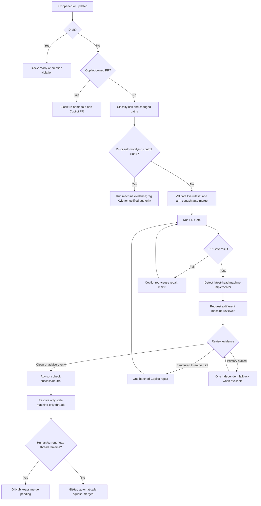

# Delivery and GitHub

## Goal

Use GitHub as the protected integration plane while keeping feedback fast, model spend bounded, and routine merges fully unattended.

## 1. Durable work model

GitHub Issues are the durable work-item source. A PR is the smallest coherent integration unit.

`Issue → SPEC only if needed → thin slices → PR (opened Ready, risk label at creation) → PR Gate → GitHub auto-merge → release → observe`

Open every PR Ready with its `risk:R*` label already applied. REST, SDK, GraphQL, and connector calls set `draft: false`; `gh pr create` omits `--draft`. Verify the returned state before any auto-merge call.

Do not enlarge PRs merely to save CI minutes. Save minutes through local slice verification, fewer pushes, cancellation, caching, and path/risk-aware tests.

## 2. Shared versus repository-specific configuration

Centralized in `agent-engineering-standard`:

- portfolio policy and repository list
- ruleset/settings application
- exact-head review evaluator and bounded review repair
- PR state machine and repair budgets
- bootstrap and idempotent upgrade scripts
- remote doctor
- workflow caller templates
- branch/worktree cleanup

Kept in each product repository:

- stack-specific `PR Gate` commands
- product PRD, specs, ADRs, tests, and release/deploy logic
- a pinned `.agent/standard.lock`
- thin `ai-review.yml` and five per-event `pr-automation*.yml` callers pinned to that exact SHA

Product callers never follow moving `@main`. Updating shared behavior is an explicit standard-upgrade PR.

## 3. Required checks and settings

Every managed repository requires this latest-head GitHub Actions context:

- `PR Gate`: deterministic repo-specific evidence. The workflow name and job name are both exactly `PR Gate` — a single check-list entry, not a separate workflow/job pair (ADR 0005 reverted the earlier `Gate: Deterministic CI` taxonomy rename because it produced a second, redundant checks-tab entry for one gate).

`AI Review` is advisory-only and off by default (ADR 0002): `independent_review.required_for_auto_merge` restores it as a required context; `solicit_reviews` runs it informationally without gating. Independent of both flags, `independent_review.dispatch_mode: disabled_pending_e2e` (ADR 0003) keeps the evaluator reachable and merge-gating without ever soliciting a reviewer: every current head still gets an `Advisory: AI Review` check, a structured threat verdict still fails it, and a head with no blocking evidence concludes `neutral` — a passing conclusion `auto-merge.ps1` accepts alongside `success`. Unreviewed auto-merge is capped at `auto_merge_max_risk: R2` while this mode is active.

Repository defaults:

- pull request required
- human approvals: `0`
- Code Owner approval: off
- native `.github/CODEOWNERS`: absent
- `kgsmith19`: forbidden from requested-reviewer state
- review-thread resolution not required (no required reviewer exists to resolve a stray thread; ADR 0002)
- stale reviews dismissed after a push
- auto-merge and update branch enabled
- squash only; merge commits and rebase disabled
- force-push and default-branch deletion blocked
- merged branches deleted
- no ruleset bypass actors
- workflow token read-only by default and unable to approve reviews
- Copilot cloud-agent workflow approval disabled

The canonical ruleset is the sole default-branch authority. Legacy branch protection is removed so it cannot silently reintroduce old checks or approvals.

## 4. Complete PR decision flow



A push always creates a new decision cycle. Old `AI Review` evidence cannot authorize a new head.

## 5. Ready-at-creation rules

Draft PRs are not part of the autonomous state machine. GitHub natively refuses to merge them, so adding conversion creates an avoidable state and race.

- Complete and verify the coherent slice locally before creating the PR.
- REST, SDK, GraphQL, and connector callers set `draft: false` and verify the returned state.
- `gh pr create` callers omit `--draft`, then verify `isDraft == false`.
- A draft event fails `PR Gate`, applies `status:blocked`, posts one actionable diagnostic, and never reaches auto-merge.
- Legacy manual conversion to Ready may clear the block, but automated conversion is forbidden.

`status:ready` remains an Issue-queue label only. It never changes PR draft state.

## 6. Machine review rules

The review is never a request to Kyle.

Reviewer independence is determined from the latest head commit's authenticated machine actor:

- Copilot-implemented head → Codex review
- Codex-implemented head → Copilot review
- human/unknown head → Codex primary with one Copilot fallback
- Claude is not counted until a mechanical GitHub review adapter exists
- branch names and editable PR text never prove identity

One response covers correctness/security, requirement fit, business ROI, systems optimization, and strict leanness.

Accepted clean evidence:

- clean formal Codex/Copilot review on the exact head
- structured Copilot `AI-REVIEW PASS` containing the exact SHA
- Codex thumbs-up created after the exact-head request

The blocking threshold is the structured threat tier (ADR 0003): only a verdict line `BLOCK: <CLASS> <file:line> — <exploit precondition>` with CLASS `T1-INFRA-DELETION`/`T2-BACKDOOR`/`T3-HARDCODED-SECRET`/`T4-CRITICAL-VULN` fails `Advisory: AI Review`, while every P0/P1/P2 prose finding is advisory — recorded once as a follow-up Issue mapped to the PR (P0/P1 entries flagged prominently), never blocking the lane. On a blocking failure the AI Review workflow requests one batched Copilot repair on the existing PR. The repaired head is then reviewed by a different provider. If that second reviewed head still has blocking findings, automation blocks rather than purchasing an open-ended loop.

The AI Review runner wakes only when semantic evidence changes: formal review, inline review comment, or PR conversation comment. Ordinary pushes do not start it; `PR Automation` performs the initial exact-head evaluation after `PR Gate` succeeds.

## 7. Recovery matrix

| Condition | Automated action | Budget | Final stop condition |
|---|---|---:|---|
| PR Gate fails | Copilot reads complete logs and fixes root cause | 3 | `status:blocked` |
| PR Gate cancelled or stale on the current head | `gate-result-router.ps1` reruns the same Actions run | 1 | `status:blocked` (`gate-rerun-exhausted`) |
| Formal or inline review carries a structured threat verdict | Copilot performs one batched repair | 1 | second reviewed head still fails |
| Codex review stalls | independent Copilot review fallback when allowed | 1 per head | 12-hour reviewer safety timeout |
| Merge conflict | Dependabot rebase or Copilot semantic conflict resolution | 2 | `status:blocked` |
| Draft opened or conversion attempted | fail workflow, apply `status:blocked`, stop before auto-merge | none | Ready state is restored explicitly |
| External-agent draft, `external_draft_promotion` on | identity-gated `promote-external-draft.ps1` marks it Ready via GraphQL | none (identity-gated, not retried) | promotion verified, or `automation-identity-missing` |
| Fork (cross-repository) PR | deny before any privileged mutation; no check run, comment, or Issue written | none | re-homed into the managed repository |
| New push after green review | invalidate old review and restart | max 2 reviewed heads | `status:blocked` |
| R4 | automated evidence, then human authority | none | explicit authorization |
| Self-modifying control plane | automated evidence, then owner integration | none | external immutable judge exists |

A stop never silently assigns Kyle as reviewer. It posts the exact blocker and tags him only when a real decision is required.

## 8. Actions and model efficiency

- deterministic checks before model review
- no AI review for policy-invalid drafts or every-push chatter
- one batched multi-lens response
- initial reviewed head plus one post-fix reviewed head
- cancel superseded deterministic/evaluator runs
- exact-head markers suppress duplicate requests
- 2-minute primary polling plus 2-minute fallback polling
- six-hourly safety watchdog (12-hour reviewer timeout when review is enabled), not continuous polling
- path filters and safe caches where useful
- expensive matrices, mutation, load, and broad E2E only when risk/path/release requires them
- measure latency, Actions minutes, model responses, findings caught, and false-positive rate before expanding review

Optimize for trustworthy outcomes per human minute, compute minute, and model cost.

## 9. Existing and new repositories

Existing portfolio rollout:

```powershell
pwsh -NoProfile -File .\scripts\upgrade-repos.ps1 -StandardSha <merged-standard-sha>
pwsh -NoProfile -File .\scripts\setup-portfolio.ps1
pwsh -NoProfile -File .\scripts\doctor.ps1 -Remote
```

`upgrade-repos.ps1` is idempotent for an existing open rollout PR, pins both shared callers to the full standard SHA, removes native CODEOWNERS, labels the rollout R3, and preserves each repository's real deterministic commands.

New repository:

```powershell
pwsh -NoProfile -File .\scripts\bootstrap-repo.ps1 -Name <repo-name>
```

Bootstrap creates the standard files, exact-SHA workflow callers, bootstrap `PR Gate`, labels/ruleset/settings, and one Issue to replace the bootstrap gate with real stack-specific evidence.

GitHub exposes the Copilot workflow-approval configuration through a public read endpoint but no documented write endpoint. New repositories therefore have one justified UI setting: disable `Require approval for workflows`. The doctor refuses readiness while it remains on.

## 10. Shared control-plane inventory

- `policy/github-defaults.json`: policy, budgets, repository list
- `scripts/apply-github-standard.ps1`: live settings, Actions defaults, labels, canonical ruleset
- `scripts/pr-orchestrator.ps1`: PR state machine and bounded recovery
- `scripts/gate-result-router.ps1`: bounded same-head rerun for a cancelled/stale `PR Gate`, then hands success/failure/action-required/skipped to `pr-orchestrator.ps1`
- `scripts/request-machine-review.ps1`: independent reviewer selection/request (inert while `dispatch_mode` is `disabled_pending_e2e`)
- `scripts/evaluate-ai-review.ps1`: formal, inline, structured, and reaction evidence → `Advisory: AI Review`, including the dispatch-disabled `neutral` path and the per-PR advisory Issue
- `scripts/request-review-repair.ps1`: one bounded repair for structured threat verdicts
- `scripts/reconcile-machine-review-threads.ps1`: safe stale machine-only thread cleanup
- `scripts/promote-external-draft.ps1`: identity-gated Ready promotion for external-agent drafts
- `scripts/auto-merge.ps1`: live-policy validation and auto-merge arming
- `scripts/bootstrap-repo.ps1`: new-repo startup
- `scripts/upgrade-repos.ps1`: explicit pinned rollout to existing repos, deriving each repository's live default branch
- `scripts/doctor.ps1 -Remote`: portfolio acceptance test
- `scripts/review-metrics.ps1`: per-PR `AI Review` outcome/latency/finding counts, the evidence base for the dispatch re-enable decision
- `scripts/prune-portfolio.ps1`: conservative worktree/branch cleanup

Reusable workflows execute these tested scripts. Thin product callers pin them to the standard-lock SHA.

## 11. Merge queue and release

Merge queue is deliberately off for the current user-owned portfolio. Enable it only after organization ownership/support and exact-head `merge_group` AI Review are implemented and proven.

Low-risk release: `merge → deploy → smoke`.

Higher-risk release: build once, promote the same immutable artifact, verify after deployment, and preserve rollback/recovery.

## 12. Fork, dispatch, and correlation mechanics

- **Fork denial.** Every privileged automation entry point — `pr-orchestrator.ps1`'s four event modes plus its watchdog, `gate-result-router.ps1`, `evaluate-ai-review.ps1`, `request-machine-review.ps1`, `request-review-repair.ps1`, `reconcile-machine-review-threads.ps1`, `promote-external-draft.ps1` — checks the PR's head repository against the target repository before any mutation. A mismatch logs `FORK-DENIED`; where a same-repository PR record exists to comment on, the orchestrator applies an explicit `fork-pr` block. The `pr-event`/`review-event` workflow jobs carry the same guard in their `if:` conditions, so a fork payload never starts the job at all.
- **External draft promotion.** `pr_automation.external_draft_promotion` lets `promote-external-draft.ps1` mark an external agent's (not the owner, not `github-actions[bot]`) draft PR Ready via the `markPullRequestReadyForReview` GraphQL mutation, gated on the dedicated `GH_TOKEN_ADMIN` identity. Without that identity it fails closed (`automation-identity-missing`) rather than tagging a human. Owner-authored and `github-actions[bot]`-authored drafts keep the hard ready-at-creation block unchanged.
- **Versioned correlation markers.** Automation comments carry markers like `<!-- automation:v1:block:<code>:<sha> -->`. Readers match both the versioned and legacy unversioned form (`automation:(?:v\d+:)?block:...`), so marker format can evolve without losing dedup/trust continuity.
- **Single-writer lock.** `ai-review.yml` and the five per-event `pr-automation*.yml` workflows share one repository-wide concurrency group, `automation-authority-${{ github.repository }}`, with `cancel-in-progress: false`. The evaluator and orchestrator never run concurrently against the same repository; GitHub queues the newest pending run per group instead of dropping it, and the six-hourly watchdog is the convergence net.
- **Quiet-mode mentions.** While `dispatch_mode` is `disabled_pending_e2e`, no comment carries an `@codex`/`@copilot`/`@dependabot`/`@kgsmith19` mention: block and authority comments name the owner as `(owner: kgsmith19)` instead, and bounded repair lanes post a recoverable `<lane>-dispatch-disabled` block instead of a repair request. See ADR 0003.
