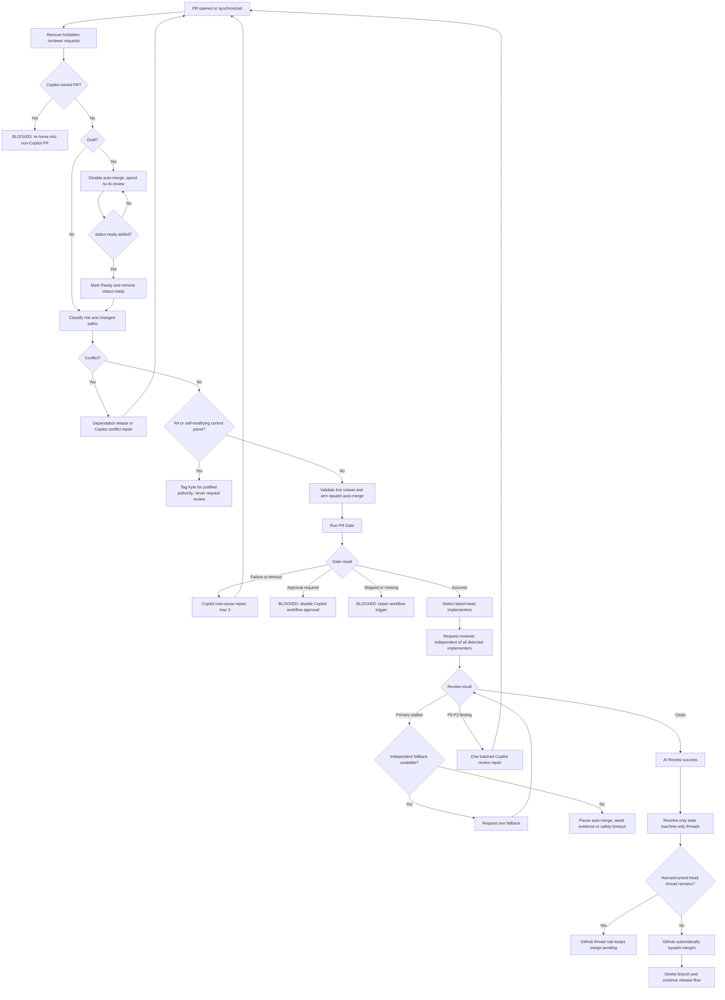

# Autonomous PR State Machine

This is the authoritative decision map for routine pull-request integration across the managed portfolio.

## Invariants

1. `main` changes through a pull request.
2. Routine human approval count is `0`.
3. Native `.github/CODEOWNERS` is absent.
4. `kgsmith19` is removed from requested-reviewer state whenever detected.
5. Kyle may be tagged only for a justified authority decision.
6. The only required status contexts are `PR Gate` and `AI Review`, both produced by GitHub Actions.
7. Both checks apply to the current head SHA.
8. A push invalidates prior semantic evidence.
9. The reviewer must differ from every detected machine implementer on the latest head commit.
10. Auto-merge is squash-only and never applies to R4 or self-modifying control-plane changes.
11. Repairs are bounded; exhaustion becomes explicit `status:blocked`, never an infinite loop.
12. Copilot may repair an existing non-Copilot PR, but a Copilot-owned PR is outside the unattended lane because GitHub requires human review and merge.
13. A material finding cannot be bypassed by reviewer-shopping on the same head.
14. Temporary reviewer latency remains recoverable; pending review pauses auto-merge and the 12-hour safety timeout is checked by a 6-hour watchdog.
15. Automation state/budget/request markers are authoritative only when posted by a trusted automation author.

## States

| State | Meaning | Exit condition |
|---|---|---|
| `DRAFT` | Implementation is still changing | `status:ready` or explicit Ready |
| `READY_UNVERIFIED` | Merge intent exists; current head is unproven | `PR Gate` starts |
| `GATE_RUNNING` | Deterministic evidence is running | pass, failure, timeout, skip, approval block, newer head |
| `CI_REPAIR` | Copilot is repairing deterministic failure on the existing PR | new head or retry exhaustion |
| `REVIEW_REQUESTED` | Independent exact-head review was requested | pass, finding, stall, newer head |
| `REVIEW_FALLBACK` | Primary reviewer stalled; one independent fallback was requested | pass, finding, safety timeout, newer head |
| `REVIEW_REPAIR` | Copilot is repairing material P0-P2 findings | new head or retry exhaustion |
| `MERGE_PENDING` | Auto-merge is armed and gates are waiting/green | GitHub merges or a blocker appears |
| `CONFLICT_REPAIR` | Dependabot/Copilot is resolving a conflict | new head or retry exhaustion |
| `AUTHORITY_REQUIRED` | Machine evidence may finish, but intent/authority cannot be inferred | Kyle explicitly decides; no reviewer assignment |
| `BLOCKED` | A true bounded/configuration failure exists | evidence proves recovery or the blocker is deliberately cleared |
| `MERGED` | GitHub completed squash merge | release/deploy/observe |
| `CLOSED` | Rejected, superseded, or abandoned | explicit reopen |

## Primary flow

## Event and decision matrix

| Event or condition | Detection | Automated action | Result |
|---|---|---|---|
| Draft opened | `pull_request_target.opened` | Remove forbidden reviewers; auto-merge off; no AI runner | `DRAFT` |
| Ready opened | PR event | Classify risk/path and arm auto-merge if eligible | `READY_UNVERIFIED` |
| `status:ready` on draft | label event | Mark Ready; remove label | `READY_UNVERIFIED` |
| Converted back to draft | `converted_to_draft` | Disable auto-merge; semantic runner stays idle | `DRAFT` |
| Push while draft | `synchronize` | No semantic spend | `DRAFT` |
| Push while Ready | new SHA | Old evidence becomes irrelevant; state restarts | `READY_UNVERIFIED` |
| `kgsmith19` requested as reviewer | `review_requested` | Immediately remove requested reviewer; tag only later if authority is truly required | routine lane |
| Stale workflow result | event SHA != current SHA | Ignore | unchanged |
| PR Gate passes | `workflow_run.success` | Recover prior gate blocks; request independent exact-head reviewer | `REVIEW_REQUESTED` |
| PR Gate fails/times out/startup fails | workflow conclusion | Copilot root-cause repair, max 3 | `CI_REPAIR` |
| PR Gate cancelled by newer push | `cancelled` | Ignore old run | unchanged |
| Workflow approval required | `action_required` | Disable auto-merge; block with exact UI setting | `BLOCKED` |
| Ready PR Gate skipped | `skipped` | Block as invalid workflow trigger/job condition | `BLOCKED` |
| No PR Gate check | watchdog | Block with missing-check reason | `BLOCKED` |
| Latest head authored/committed by Copilot | commit actor | Exclude Copilot; Codex is accepted if independent | review lane |
| Latest head authored/committed by Codex | commit actor | Exclude Codex; Copilot is accepted if independent | review lane |
| Latest head contains both Codex and Copilot machine actors | commit actor set | No connected independent reviewer; fail closed | `BLOCKED`/new independent provider required |
| Latest head human/unknown | no machine actor | Codex primary; Copilot fallback | review lane |
| Clean formal review | exact commit ID, no P0-P2 | Set `AI Review` success | `MERGE_PENDING` |
| Codex thumbs-up | reaction on trusted exact-head request | Set `AI Review` success | `MERGE_PENDING` |
| Structured Copilot PASS | exact SHA in response | Set `AI Review` success | `MERGE_PENDING` |
| P0-P2 finding | exact-head formal/inline review/comment | Set failure; one batched Copilot repair | `REVIEW_REPAIR` |
| Same-head repair comment retriggers workflows | trusted repair marker for current SHA | Treat as pending; do not consume another repair attempt | `REVIEW_REPAIR` |
| Primary reviewer stalls for fast window | trusted request timestamp | Request one independent fallback when available | `REVIEW_FALLBACK` |
| Fast primary+fallback windows expire | bounded polling | Pause auto-merge; late review events can still recover | review waiting |
| Review reaches 12-hour safety timeout | 6-hour watchdog sees age >= 720 min | Disable auto-merge; add `status:blocked` | `BLOCKED` |
| Late valid review after timeout block | review/comment event | Set success, resolve automation block, re-arm auto-merge | `MERGE_PENDING` |
| Review dismissed | review event | Re-evaluate; withdraw success when proof disappears | review waiting/blocking |
| New push after clean review | new SHA | Prior review cannot authorize it; repeat full cycle | `READY_UNVERIFIED` |
| Old machine-only thread remains | successful new-head review + GraphQL audit | Resolve only if all participants are recognized machines and no comment belongs to current head | thread cleared |
| Human participated in thread | thread audit | Never auto-resolve | merge pending |
| Current-head machine thread remains | thread audit | Never auto-resolve | review/fix required |
| Ordinary merge conflict | mergeability | Copilot semantic resolution, max 2 | `CONFLICT_REPAIR` |
| Dependabot conflict | author identity | `@dependabot rebase`, max 2 | `CONFLICT_REPAIR` |
| Conflict disappears after update | PR event | Resolve automation conflict block | normal lane resumes |
| Auto-merge disabled by contributor push | PR event/live state | Revalidate and re-arm | `MERGE_PENDING` |
| Base branch not default | auto-merge validator | Refuse auto-merge | blocked/correct target |
| Multiple risk labels | risk parser | Fail closed | `BLOCKED` |
| Risk labels corrected | PR event | Resolve risk block automatically | normal lane resumes |
| No risk label | risk parser | Default R2 | routine lane |
| R0-R3 product change | risk/path | Eligible after gates | routine lane |
| R4 | label | Tag Kyle with four authority fields; never assign reviewer | `AUTHORITY_REQUIRED` |
| Product PR changes control files | path classifier | Treat as control plane | `AUTHORITY_REQUIRED` |
| Any standard-repo PR | repository identity | Self-modifying control plane | `AUTHORITY_REQUIRED` |
| Copilot-owned PR | PR author/branch | Disable auto-merge; require re-home | `BLOCKED` |
| Copilot edits existing non-Copilot PR | latest commit actor | Full gates repeat; independent reviewer excludes Copilot | routine lane |
| Dependabot patch/minor PR | dependency PR | Full gates; eligible if risk is appropriate | routine lane |
| Dependabot major PR | dependency scope | Must be separately risk-classified | R2/R3/block |
| CI repair reaches 3 | trusted markers | Disable auto-merge and block | `BLOCKED` |
| Post-fix reviewed head still has P0-P2 | reviewed-head budget | Disable auto-merge and block | `BLOCKED` |
| Conflict repair reaches 2 | trusted markers | Disable auto-merge and block | `BLOCKED` |
| Untrusted commenter forges automation marker | marker author check | Ignore marker for state, budgets, evidence, and duplicate suppression | unchanged |
| Automation evidence later proves recovery | success event/current facts | Post trusted recovery marker; remove label when no active automation block remains | normal lane resumes |
| Manually applied `status:blocked` with no trusted automation marker | label | Treat as authoritative; never auto-clear | `BLOCKED` |
| Checks green but unresolved thread | ruleset | GitHub refuses merge | merge pending |
| Checks and threads clear | GitHub auto-merge | Squash merge; delete branch | `MERGED` |
| Closed/superseded | PR state | Ignore | `CLOSED` |
| Reopened | PR event | Re-evaluate all current facts | appropriate state |

## Retry and cost bounds

| Lane | Bound | Reason |
|---|---:|---|
| CI repair | 3 | root cause, correction, final attempt without loops |
| Review repair | 1 batched repair | two reviewed heads total: initial plus post-fix |
| Conflict repair | 2 | resolution plus one correction |
| Reviewed head SHAs | 2 | coherent head plus one post-fix head |
| Fallback reviewer | 1 per head when independent | fallback, not a default second review |
| Fast review polling | 3 + 3 minutes | catch reaction-only review without indefinite runner use |
| Reviewer safety timeout | 12 hours | service-stall boundary |
| Watchdog | every 6 hours | safety net checks before the 12-hour deadline; normal operation is event-driven |
| AI Review workflow | review/review-comment/structured-review-comment events only | no runner on ordinary PR pushes or implementation chatter |

## `status:blocked`

This is not a generic waiting state. It means a concrete fact exists:

- bounded repair budget exhausted
- required settings/ruleset invalid
- workflow approval remains manual
- required workflow/check missing or skipped
- reviewer safety timeout exceeded
- risk labels contradictory
- no connected reviewer remains independent of all detected latest-head machine actors
- PR is Copilot-owned and therefore platform-human-merge-only

Automation posts a machine-readable block marker and exact reason. When later objective evidence proves a recoverable automation block is fixed, it posts a trusted resolution marker and removes the label only when no active trusted automation block remains. A manually applied block has no trusted automation marker and is never auto-cleared.

## Authority versus review

Kyle is never a routine reviewer. When authority is genuinely required, automation posts an `@kgsmith19` comment with:

1. failure class prevented
2. why automation cannot decide
3. decision owner
4. measurable removal condition

That is intentionally different from GitHub requested-reviewer state.

## Live proof plan

The implementation is incomplete until these canaries succeed:

1. Draft: checks/review/merge remain paused.
2. Ready label: `status:ready` promotes the draft.
3. Happy path: gate passes, independent machine reviewer passes, GitHub auto-merges with no human action.
4. Finding: deliberate formal or inline finding blocks; Copilot repairs existing PR; new head is independently reviewed; merge completes.
5. CI failure: deliberate failure creates one bounded repair task and never weakens the gate.
6. Conflict: controlled conflict enters repair lane and cannot merge stale code.
7. Dependabot: safe dependency PR follows the same gates.
8. Reviewer: a `kgsmith19` request is removed automatically.
9. Marker trust: a forged automation marker from an untrusted commenter has no effect on state, budgets, evidence, or duplicate suppression.
10. Settings: workflow-approval or auto-merge drift causes doctor/canary failure.
11. Portfolio: `doctor.ps1 -Remote` reports every managed repository `READY`.

Only a real PR merging itself earns the claim **auto-merge proven**. Other canaries prove recovery and fail-closed behavior.
