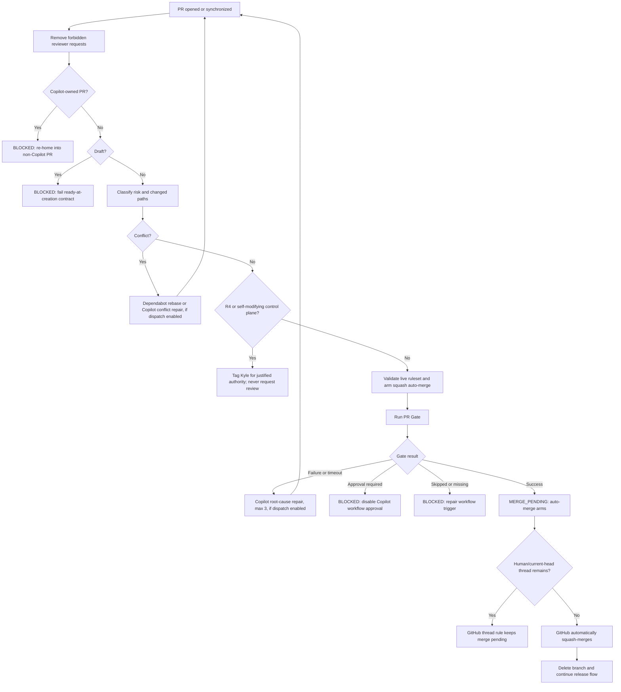

# Autonomous PR State Machine

This is the authoritative decision map for routine pull-request integration across the managed portfolio.

> **ADR 0004 (2026-08-11):** inline AI code review was removed from the blocking merge path entirely. The deterministic `PR Gate` is now the *only* required status context and the only precondition for arming auto-merge. The `REVIEW_REQUESTED`, `REVIEW_FALLBACK`, and `REVIEW_REPAIR` states, the `Advisory: AI Review` check, and the review-dispatch canary (ADR 0003) no longer exist. `scripts/codex-review.ps1` remains available as an optional local manual second opinion; it is never part of this state machine. R4 and self-modifying control-plane changes still require the owner's manual authority sign-off (unchanged, unaffected by this amendment) — see `SECURITY_RISK_AUTONOMY.md`.
>
> **Taxonomy amendment (2026-08-09, ADR 0003):** the gate workflow/job are renamed `Gate: Deterministic CI` (a transitional `pr-gate-bridge` job keeps the ruleset-required `PR Gate` context green until the owner flips it — context-rename runbook), and the orchestrator workflows are `Orchestrator: PR Lifecycle / Gate Result / Watchdog`.

## Invariants

1. `main` changes through a pull request.
2. Routine human approval count is `0`.
3. Native `.github/CODEOWNERS` is absent.
4. `kgsmith19` is removed from requested-reviewer state whenever detected.
5. Kyle may be tagged only for a justified authority decision.
6. `PR Gate` is the sole required status context and the sole merge authority (ADR 0004).
7. A push invalidates prior gate evidence; a new head restarts the cycle.
8. Auto-merge is squash-only and never applies to R4 or self-modifying control-plane changes.
9. Repairs are bounded; exhaustion becomes explicit `status:blocked`, never an infinite loop.
10. Copilot may repair an existing non-Copilot PR's CI failure or conflict when repair dispatch is enabled, but a Copilot-owned PR is outside the unattended lane because GitHub requires human review and merge.
11. Automation state/budget/request markers are authoritative only when posted by a trusted automation author.
12. Every PR is Ready at creation. Draft state is a policy violation, not an implementation state.
13. A PR whose head repository is not the target repository (a fork) is denied before any privileged automation runs. No check run, comment, or Issue is ever written for a fork head; automation blocks the target-repo record only, `fork-pr`, and re-homing is the only exit.

## States

| State | Meaning | Exit condition |
|---|---|---|
| `PR_CONTRACT_BLOCKED` | A PR was opened or converted to draft | explicit Ready state followed by fresh evaluation |
| `READY_UNVERIFIED` | Merge intent exists; current head is unproven | `PR Gate` starts |
| `GATE_RUNNING` | Deterministic evidence is running | pass, failure, timeout, skip, approval block, newer head |
| `CI_REPAIR` | Copilot is repairing deterministic failure on the existing PR (if repair dispatch enabled) | new head or retry exhaustion |
| `MERGE_PENDING` | Auto-merge is armed and gates are waiting/green | GitHub merges or a blocker appears |
| `CONFLICT_REPAIR` | Dependabot/Copilot is resolving a conflict (if repair dispatch enabled) | new head or retry exhaustion |
| `AUTHORITY_REQUIRED` | Machine evidence may finish, but intent/authority cannot be inferred | Kyle explicitly decides; no reviewer assignment |
| `BLOCKED` | A true bounded/configuration failure exists | evidence proves recovery or the blocker is deliberately cleared |
| `MERGED` | GitHub completed squash merge | release/deploy/observe |
| `CLOSED` | Rejected, superseded, or abandoned | explicit reopen |

## Primary flow

## Event and decision matrix

| Event or condition | Detection | Automated action | Result |
|---|---|---|---|
| Draft opened | `pull_request_target.opened` | Disable auto-merge; apply `status:blocked`; post one diagnostic; fail workflow | `PR_CONTRACT_BLOCKED` |
| Ready opened | PR event | Classify risk/path and arm auto-merge if eligible | `READY_UNVERIFIED` |
| Fork PR (head repository differs from target repository) | `head.repo.full_name` / head-repository-owner mismatch | Deny before any privileged mutation in every entry point (workflow `if:` guards plus each script's own check); no check run, comment, or Issue is ever written for the fork head | `BLOCKED` (`fork-pr`; re-home into the managed repository) |
| Converted to draft | `converted_to_draft` | Disable auto-merge; apply block; fail workflow; never auto-convert | `PR_CONTRACT_BLOCKED` |
| Legacy draft explicitly made Ready | `ready_for_review` | Resolve the draft block and re-evaluate all current facts | `READY_UNVERIFIED` |
| Push while draft | `synchronize` | Repeat the visible contract failure | `PR_CONTRACT_BLOCKED` |
| Push while Ready | new SHA | Old evidence becomes irrelevant; state restarts | `READY_UNVERIFIED` |
| `kgsmith19` requested as reviewer | `review_requested` | Immediately remove requested reviewer; tag only later if authority is truly required | routine lane |
| Stale workflow result | event SHA != current SHA | Ignore | unchanged |
| PR Gate passes | `workflow_run.success` | Recover prior gate blocks; arm auto-merge | `MERGE_PENDING` |
| PR Gate fails/times out/startup fails | workflow conclusion | Copilot root-cause repair, max 3, if repair dispatch enabled; otherwise recoverable `ci-dispatch-disabled` block | `CI_REPAIR` or `BLOCKED` |
| PR Gate cancelled by newer push | `cancelled`, stale head | Ignore old run | unchanged |
| PR Gate cancelled or stale on the current head | `cancelled`/`stale`, current head | `gate-result-router.ps1` reruns the same Actions run once; a repeat becomes an explicit block | rerun once, then `BLOCKED` (`gate-rerun-exhausted`) |
| PR Gate concludes `neutral` | workflow conclusion | Block: a required deterministic gate must produce `success` or an actionable failure | `BLOCKED` (`gate-neutral`) |
| PR Gate returns an unrecognized conclusion | workflow conclusion | Fail closed instead of ignoring it | `BLOCKED` (`gate-unknown`) |
| Workflow approval required | `action_required` | Disable auto-merge; block with exact UI setting | `BLOCKED` |
| Ready PR Gate skipped | `skipped` | Block as invalid workflow trigger/job condition | `BLOCKED` |
| No PR Gate check | watchdog | Block with missing-check reason | `BLOCKED` |
| Dispatch disabled (`pr_automation.repair_dispatch_enabled: false`, the default) and a bounded repair lane would otherwise fire | CI/conflict repair trigger | Post no `@copilot`/`@dependabot` tag; apply a recoverable `<lane>-dispatch-disabled` block instead | `BLOCKED`, clears automatically once dispatch is enabled |
| Same-head repair comment retriggers workflows | trusted repair marker for current SHA | Treat as pending; do not consume another repair attempt | `CI_REPAIR`/`CONFLICT_REPAIR` |
| Ordinary merge conflict | mergeability | Copilot semantic resolution, max 2, if dispatch enabled | `CONFLICT_REPAIR` |
| Dependabot conflict | author identity | `@dependabot rebase`, max 2, if dispatch enabled | `CONFLICT_REPAIR` |
| Conflict disappears after update | PR event | Resolve automation conflict block | normal lane resumes |
| Auto-merge disabled by contributor push | PR event/live state | Revalidate and re-arm | `MERGE_PENDING` |
| Base branch not default | auto-merge validator | Refuse auto-merge | blocked/correct target |
| Additional active ruleset governs default branch | effective branch-rules audit in setup, doctor, and runtime arming | Refuse READY/auto-merge until authority is reconciled | blocked/configuration repair |
| Multiple risk labels | risk parser | Fail closed | `BLOCKED` |
| Risk labels corrected | PR event | Resolve risk block automatically | normal lane resumes |
| No risk label | risk parser | Default R2 | routine lane |
| R0-R3 product change | risk/path | Eligible after gates | routine lane |
| R4 | label | Tag Kyle with four authority fields; never assign reviewer | `AUTHORITY_REQUIRED` |
| Product PR changes control files | path classifier | Treat as control plane | `AUTHORITY_REQUIRED` |
| Any standard-repo PR | repository identity | Self-modifying control plane | `AUTHORITY_REQUIRED` |
| Copilot-owned PR | PR author/branch | Disable auto-merge; require re-home | `BLOCKED` |
| Copilot edits existing non-Copilot PR | latest commit actor | Full gates repeat | routine lane |
| External-agent draft (not owner, not `github-actions[bot]`), `pr_automation.external_draft_promotion` on | draft PR author | Identity-gated `promote-external-draft.ps1` marks it Ready via GraphQL (`GH_TOKEN_ADMIN`) and re-verifies | `READY_UNVERIFIED`, or `BLOCKED` (`automation-identity-missing`) without the identity |
| Dependabot patch/minor PR | dependency PR | Full gates; eligible if risk is appropriate | routine lane |
| Dependabot major PR | dependency scope | Must be separately risk-classified | R2/R3/block |
| CI repair reaches 3 | trusted markers | Disable auto-merge and block | `BLOCKED` |
| Conflict repair reaches 2 | trusted markers | Disable auto-merge and block | `BLOCKED` |
| Untrusted commenter forges automation marker | marker author check | Ignore marker for state, budgets, and duplicate suppression | unchanged |
| Automation evidence later proves recovery | success event/current facts | Post trusted recovery marker; remove label when no active automation block remains | normal lane resumes |
| Manually applied `status:blocked` with no trusted automation marker | label | Treat as authoritative; never auto-clear | `BLOCKED` |
| Checks green | ruleset | GitHub refuses merge only if a real unresolved thread exists | merge pending / merges |
| Checks clear | GitHub auto-merge | Squash merge; delete branch | `MERGED` |
| Closed/superseded | PR state | Ignore | `CLOSED` |
| Reopened | PR event | Re-evaluate all current facts | appropriate state |

## Retry and cost bounds

| Lane | Bound | Reason |
|---|---:|---|
| CI repair | 3 | autonomous repair loop before a human is asked |
| Conflict repair | 2 | autonomous resolution loop before a human is asked |
| Gate rerun (cancelled/stale, current head) | 1 | recover a transient Actions hiccup before blocking |
| Watchdog | six-hourly | general missed-webhook/CI-gate convergence net; normal operation is event-driven |

## `status:blocked`

This is not a generic waiting state. It means a concrete fact exists:

- bounded repair budget exhausted
- required settings/ruleset invalid
- workflow approval remains manual
- required workflow/check missing or skipped
- risk labels contradictory
- PR is draft or was converted to draft
- PR is Copilot-owned and therefore platform-human-merge-only
- PR head repository is not the target repository (fork)
- a bounded repair lane would need an outbound agent tag while repair dispatch is disabled (self-clears once dispatch is enabled)

Automation posts a machine-readable block marker and exact reason. When later objective evidence proves a recoverable automation block is fixed, it posts a trusted resolution marker and removes the label only when no active trusted automation block remains. A manually applied block has no trusted automation marker and is never auto-cleared.

## Authority versus review

Kyle is never a routine reviewer. When authority is genuinely required, automation posts an `@kgsmith19` comment with:

1. failure class prevented
2. why automation cannot decide
3. decision owner
4. measurable removal condition

That is intentionally different from GitHub requested-reviewer state. While `pr_automation.repair_dispatch_enabled` is `false` (the default), this comment names the owner as `(owner: kgsmith19)` instead of `@kgsmith19` — the four fields are unchanged; only the mention is withheld, so an intentionally quiet automated system never pages a human.

## Live proof plan

The implementation is incomplete until these canaries succeed:

1. Ready-at-creation: a Ready canary enters `PR Gate` immediately.
2. Draft rejection: a deliberate draft receives `status:blocked`, a failing contract diagnostic, no `gh pr ready`, and no auto-merge attempt.
3. Happy path: gate passes, GitHub auto-merges with no human action.
4. CI failure: deliberate failure creates one bounded repair task (or a `ci-dispatch-disabled` block if dispatch is off) and never weakens the gate.
5. Conflict: controlled conflict enters repair lane and cannot merge stale code.
6. Dependabot: safe dependency PR follows the same gates.
7. Reviewer: a `kgsmith19` request is removed automatically.
8. Marker trust: a forged automation marker from an untrusted commenter has no effect on state, budgets, or duplicate suppression.
9. Settings: workflow-approval or auto-merge drift causes doctor/canary failure.
10. Portfolio: `doctor.ps1 -Remote` reports every managed repository `READY`.

Only a real PR merging itself earns the claim **auto-merge proven**. Other canaries prove recovery and fail-closed behavior.
