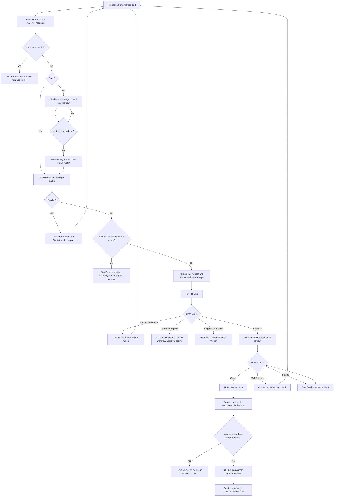

# Autonomous PR State Machine

This document is the authoritative decision map for routine pull-request integration across the managed portfolio.

## Non-negotiable invariants

1. `main` changes through a pull request.
2. Routine human approval count is `0`.
3. Native `.github/CODEOWNERS` is absent.
4. `kgsmith19` is removed from requested-reviewer state whenever detected.
5. Kyle may be tagged only for a justified authority decision.
6. The only required status contexts are `PR Gate` and `AI Review`, both produced by GitHub Actions.
7. Both checks must apply to the current head SHA.
8. A push invalidates prior semantic evidence.
9. Auto-merge is squash-only and is never allowed for R4 or self-modifying control-plane changes.
10. Repair attempts are bounded; exhaustion becomes an explicit `status:blocked`, never an infinite loop.
11. Copilot cloud agent may repair an existing non-Copilot PR, but a Copilot-owned PR cannot use the unattended lane because GitHub requires human review and merge.
12. A review failure cannot be bypassed by shopping for another reviewer on the same head.

## States

| State | Meaning | Exit condition |
|---|---|---|
| `DRAFT` | Implementation is still changing | `status:ready` is added, or a person/agent marks Ready |
| `READY_UNVERIFIED` | PR is merge-intent but current head is unproven | `PR Gate` starts |
| `GATE_RUNNING` | Deterministic evidence is running | success, failure, timeout, skip, approval block, cancellation |
| `CI_REPAIR` | Copilot is repairing deterministic failure on the existing PR | new head pushed, or retry budget exhausted |
| `REVIEW_REQUESTED` | Exact-head Codex review was requested | pass, finding, stall, head change |
| `REVIEW_FALLBACK` | Codex stalled; one Copilot review was requested | pass, finding, timeout, head change |
| `REVIEW_REPAIR` | Copilot is repairing material P0–P2 review findings | new head pushed, or retry budget exhausted |
| `MERGE_PENDING` | Auto-merge is armed and all current known gates are waiting/green | GitHub squash-merges, or a new blocker appears |
| `CONFLICT_REPAIR` | Dependabot or Copilot is resolving merge conflicts | new head pushed, or retry budget exhausted |
| `AUTHORITY_REQUIRED` | Machine evidence may finish, but intent/authority cannot be inferred | Kyle explicitly decides; no reviewer assignment |
| `BLOCKED` | A bounded automation lane exhausted or configuration is invalid | blocker fixed and `status:blocked` explicitly removed |
| `MERGED` | GitHub completed squash merge | release/deploy/observe |
| `CLOSED` | Work rejected, superseded, or abandoned | reopen only with an explicit reason |

## Primary flow

## Event and decision matrix

| Event or condition | Detection | Automated action | Result |
|---|---|---|---|
| Draft PR opened | `pull_request_target.opened` | Remove forbidden reviewers; keep auto-merge off; no machine review | `DRAFT` |
| Ready PR opened | `pull_request_target.opened` | Classify risk/path; arm auto-merge if eligible | `READY_UNVERIFIED` |
| `status:ready` added to draft | `pull_request_target.labeled` | Mark Ready; remove the label | `READY_UNVERIFIED` |
| Draft converted back from Ready | `converted_to_draft` | Disable auto-merge; do not auto-promote unless label is re-added | `DRAFT` |
| Push while draft | `synchronize` | No semantic review; auto-merge remains off | `DRAFT` |
| Push while Ready | `synchronize` | Old SHA evidence becomes irrelevant; re-evaluate risk/conflict; re-arm if GitHub disabled auto-merge | `READY_UNVERIFIED` |
| Stale `workflow_run` for older SHA | compare event SHA to current head | Ignore | no state change |
| PR Gate starts | GitHub Actions | Run repository-specific objective evidence | `GATE_RUNNING` |
| PR Gate passes | `workflow_run.success` | Request one exact-head Codex review; poll briefly | `REVIEW_REQUESTED` |
| PR Gate fails | `workflow_run.failure` | Comment one bounded Copilot repair task with full run ID | `CI_REPAIR` |
| PR Gate times out/startup fails | workflow conclusion | Same root-cause repair lane | `CI_REPAIR` |
| PR Gate cancelled by newer push | workflow conclusion `cancelled` | Ignore old run; newer SHA owns state | no state change |
| PR Gate action required | workflow conclusion `action_required` | Add `status:blocked`; identify Copilot workflow-approval setting | `BLOCKED` |
| PR Gate skipped on Ready PR | conclusion `skipped` | Add `status:blocked`; workflow trigger/job condition is invalid | `BLOCKED` |
| No PR Gate check exists | watchdog | Add `status:blocked` | `BLOCKED` |
| Codex clean formal review | exact commit ID, no P0–P2 | Set `AI Review` success | `MERGE_PENDING` |
| Codex exact-head thumbs-up | reaction after exact-head request | Set `AI Review` success | `MERGE_PENDING` |
| Codex P0–P2 finding | exact-head review body/state | Set `AI Review` failure; ask Copilot to repair | `REVIEW_REPAIR` |
| Codex does not respond in primary window | request timestamp | Request one Copilot fallback review | `REVIEW_FALLBACK` |
| Copilot structured `AI-REVIEW PASS` | exact SHA in response | Set `AI Review` success | `MERGE_PENDING` |
| Copilot structured `AI-REVIEW FAIL` | exact SHA in response | Set failure; ask Copilot to repair on existing PR | `REVIEW_REPAIR` |
| Both review windows expire | bounded polling | Add `status:blocked` with timeout reason | `BLOCKED` |
| Review dismissed | `pull_request_review.dismissed` | Re-evaluate exact-head evidence; success is withdrawn if no valid proof remains | review waiting/blocking |
| New push after review pass | new head SHA | Old `AI Review` cannot satisfy current head; full cycle repeats | `READY_UNVERIFIED` |
| Machine thread from older head remains | clean new-head review plus GraphQL thread audit | Resolve only if every participant is a recognized machine and no comment belongs to current head | thread cleared |
| Human participated in thread | thread audit | Never auto-resolve | GitHub thread rule blocks merge |
| Current-head machine thread remains | thread audit | Never auto-resolve | review/fix required |
| Merge conflict on ordinary PR | mergeability | Ask Copilot to semantically resolve; max 2 | `CONFLICT_REPAIR` |
| Merge conflict on Dependabot PR | author identity | `@dependabot rebase`; max 2 | `CONFLICT_REPAIR` |
| Conflict repair does not push | watchdog sees same conflict | Retry until budget, then block | `BLOCKED` |
| Auto-merge disabled by later contributor push | PR event + live state | Re-run policy validation and re-arm | `MERGE_PENDING` |
| Base branch changes | PR event and auto-merge behavior | `auto-merge.ps1` refuses non-default branch | `BLOCKED`/manual correction |
| Multiple risk labels | risk parser | Fail closed and block | `BLOCKED` |
| No risk label | risk parser | Default to R2 | routine lane |
| R0–R3 product change | risk/path | Eligible after gates | `MERGE_PENDING` |
| R4 | risk label | Tag Kyle with all four authority fields; never assign reviewer | `AUTHORITY_REQUIRED` |
| Product PR changes workflow/policy/control files | path classifier | Treat as control plane; tag Kyle; no auto-merge | `AUTHORITY_REQUIRED` |
| Any PR in `agent-engineering-standard` | repository identity | Treat as self-modifying control plane | `AUTHORITY_REQUIRED` |
| `kgsmith19` requested as reviewer | REST requested-reviewer audit | Remove request and post explanation | normal lane continues |
| Another human is requested | not forbidden by current policy | Does not satisfy machine gate; may be removed later if policy expands | machine gate still controls |
| Copilot-created PR/draft | author or `copilot/*` branch | Disable auto-merge; block and require re-home | `BLOCKED` |
| Copilot edits an existing non-Copilot PR | PR author remains non-Copilot | Workflow approval setting permits checks; full gates repeat | normal lane |
| Dependabot patch/minor PR | normal PR plus dependency grouping | Full PR Gate + machine review; eligible for auto-merge | routine lane |
| Dependabot major update | scope/risk assessment | Must be separately classified; do not assume low risk | R2/R3 or block |
| CI repair reaches 3 attempts | comment markers | Add `status:blocked`; stop tagging agents | `BLOCKED` |
| Review repair reaches 2 attempts | comment markers | Add `status:blocked`; stop | `BLOCKED` |
| Conflict repair reaches 2 attempts | comment markers | Add `status:blocked`; stop | `BLOCKED` |
| `status:blocked` exists | PR event/watchdog | Disable auto-merge and stop | `BLOCKED` |
| Blocker is fixed | explicit label removal/new event | State machine resumes from current facts | appropriate state |
| All checks green but unresolved thread | GitHub ruleset | GitHub refuses merge | thread resolution needed |
| All checks and threads clear | GitHub auto-merge | Squash merge and delete branch | `MERGED` |
| PR closed as superseded/rejected | PR state | Automation ignores it | `CLOSED` |
| PR reopened | `reopened` | Re-evaluate from current head and labels | appropriate state |

## Retry budgets

| Lane | Maximum | Why |
|---|---:|---|
| CI repair | 3 | enough for root cause, one correction, one final attempt without loops |
| Review repair | 2 | initial finding fix plus one correction |
| Conflict repair | 2 | semantic resolution plus one correction |
| Reviewed head SHAs | 2 | initial coherent head plus one post-fix head |
| Copilot review fallback | 1 per reviewed head | fallback, not a second default reviewer |
| Watchdog | every 12 hours | safety net only; normal behavior is event-driven |

## What `status:blocked` means

`status:blocked` is not a generic waiting state. It means one of these facts is true:

- bounded repair/review/conflict budget is exhausted
- a required repository setting/ruleset is incorrect
- workflow approval is still manual
- the required workflow/check is missing or skipped
- reviewer service did not return within the bounded window
- risk labels are contradictory
- the PR is Copilot-owned and therefore platform-human-merge-only

The automation posts the exact code/reason. Clearing the label without correcting the reason is invalid.

## Authority versus review

Kyle is never used as a routine reviewer. When authority is genuinely required, automation posts an `@kgsmith19` comment with:

1. failure class prevented
2. why automation cannot decide
3. decision owner
4. measurable removal condition

This is intentionally different from GitHub's requested-reviewer mechanism.

## Proof plan

The implementation is not considered complete until these live canaries succeed:

1. Draft canary: checks/review/merge remain paused.
2. Ready-label canary: `status:ready` promotes the draft.
3. Happy-path canary: PR Gate passes, machine review passes, GitHub auto-merges without human action.
4. Finding canary: a deliberate review finding blocks; repair pushes a new head; full cycle repeats.
5. CI-failure canary: deliberate failing test blocks and creates one repair task.
6. Conflict canary: controlled conflict starts the conflict lane and does not merge stale code.
7. Dependabot canary: a safe dependency PR follows the same gates.
8. Reviewer canary: a `kgsmith19` reviewer request is removed automatically.
9. Settings canary: enabling workflow approval or disabling auto-merge causes doctor/canary failure.
10. Portfolio verification: `doctor.ps1 -Remote` reports every managed repository `READY`.

Only the successful live happy-path auto-merge earns the claim **auto-merge proven**. Other canaries prove recovery and fail-closed behavior.
